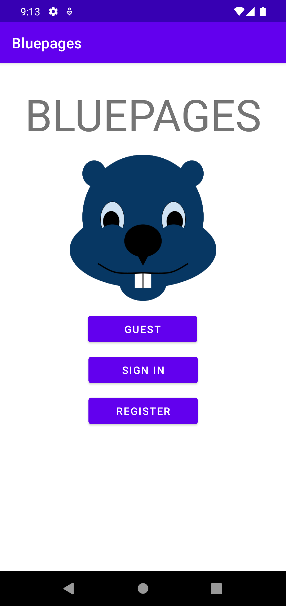
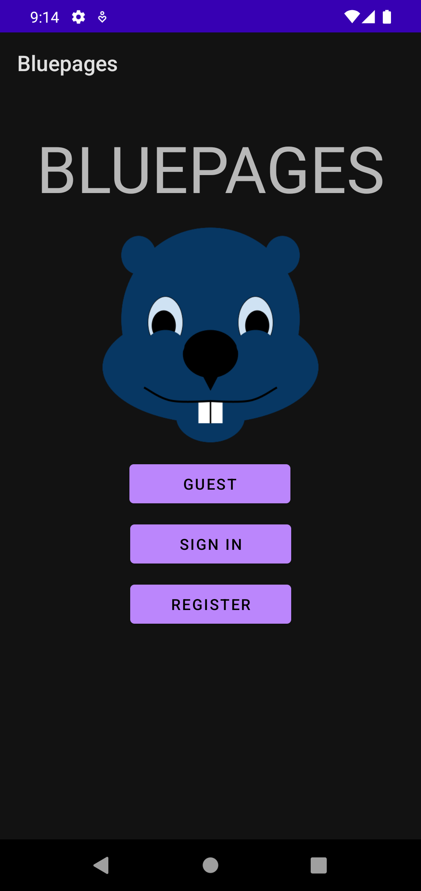
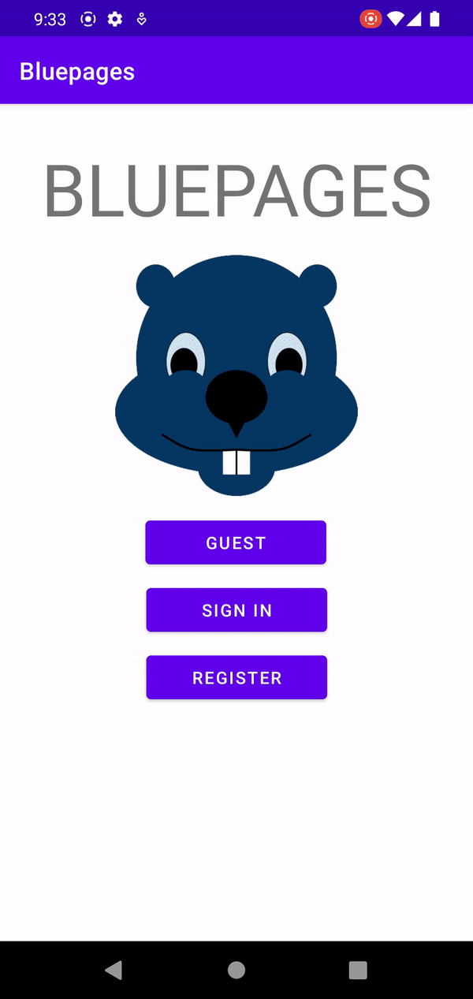
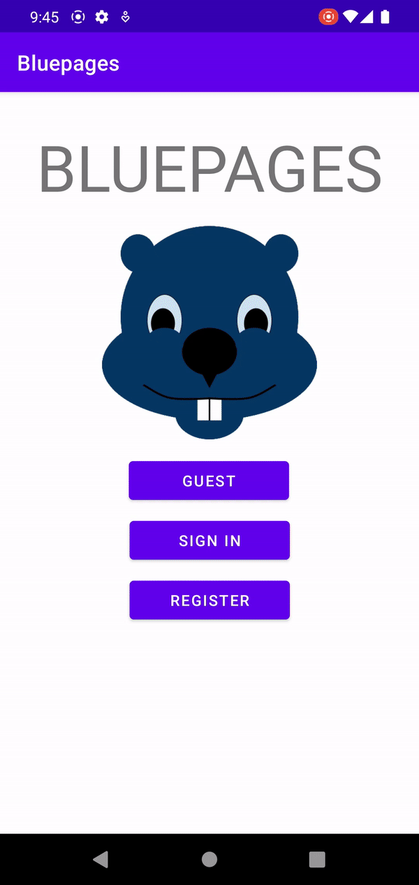

# Design Document #

## Specification ##

Bluepages is a location-browser app tailored to UofT students looking for places nearby the St. George Campus to grab food from, or study at. Users can share their opinions on places in the form of a review, and can also view what others think as well, thus helping them decide whether it's a place they'd like to visit.

- To browse the app, users can either create an account, login, or continue as a guest (no account).

| Light Mode | Dark Mode |
|----------|------------|
|       |         |

### Permissions based off login-type

| User-type  | Permissions |
|------------|-------------|
| Guest users can...     | <ul><li>View a randomly selected food and study spot of the day.</li><li>Search for locations, and further tune their search using filters.</li><li>Use the interactive map to browse locations in their vicinity.</li></ul>            |
| Registered users can... | <ul><li>Do everything a guest user can do.</li><li>Bookmark locations for easy access in the future.</li><li>Leave reviews and a rating for locations.</li></ul>            |

### Locations ###

Across both types of locations, general information such as name and address are provided.

| Location-type | Information-shown |
|---------------|-------------------|
| Food          | <ul><li>Food type (i.e. Japanese).</li><li>Whether it's dine-in or takeout.</li><li>Price range.</li></ul>                  |
| Study         | <ul><li>Whether it's indoors or outdoors.</li><li>Study room availability (if indoors).</li></ul>                  |

## Changes From Phase0 ##

From phase 0 to phase 1, we took the command-line interface and built upon it to have an Android app complete with a GUI. With this addition, the user can now use an interactive map to browse locations. Below are demonstrations of the benefits this move to Android has conveyed:

| Login | Registration | Map Browsing |
|--------------|---------------|---------------|
|  |       |  |

## Major decisions made by our group: ##
- Moving to Android vs. web application: we decided to move our app over to Android, as it better fit our original view of what we wanted to do with this project.

## Scenario walk-through 
Upon opening Bluepages, the user is greeted with an access menu from which three options are available; guest, login, and register. If the user is new to the app and wants extra functionality, they would select "REGISTER".

They are now presented with a registration menu where they can enter their information. After validating the entered information (i.e. username and password), they are returned to the main menu where they can select the login option.

From here, the user selects "LOGIN", and enters the info which they used to sign up for Bluepages. Upon successful login, the user is brought to the main menu where they can view the food/study spot of the day, access bookmarks/reviews, and view the map.

If "MAP" is selected, the user is presented with a map bound to the vicinity of the St. George Campus, and within these bounds the map is freely pannable and zoomable. Should manual browsing not be the user's go-to, they can use the search bar to look-up nearby locations, presented as a command-line output.

## Clean Architecture
**_How does our project adhere to Clean Architecture?_**
- The code is independent of the Android UI, and external agency and of the database
- The code follows the dependency rule (see dependency inversion under SOLID principles for more info)

## Solid Principles
_**How is our project consistent with the SOLID design principles?**_

| SOLID Principle       | Example |
|-----------------------|---------|
| Single responsibility | Examining `AccountList` and `AccountManager`, the two are separate classes to hold in line with the SRP. Originally we had combined the responsibility of account storage and account creation/deletion in one class. In that case, should an actor want to change the process in how an account is created, then it would have also affected the storage of said account. With these two classes, if said actor were to change the process of account creation, the only changes made would be in `AccountManager`, because we still have `RegisteredUser` being stored in `AccountList`, the only difference is how the `RegisteredUser` is made in `AccountManager`.        |
| Interface segregation | Our Serializer and AccountManagerDependency interfaces are kept small, only defining the crucial methods needed         |
| Dependency inversion  | In general, our entities such as a RegisteredUser do not know about for example the Android UI, any use cases or controllers. Instead, the CommandLine generates an instance of the InputController and InputGateway. The InputController and InputGateways then generate instances of an AccountManager and an AccountManager is able to instantiate a new RegisteredUser. This flow illustrates how our code only points inwards, consistent with the dependency rule        |

## Packaging ##

_**Which packaging strategies did we consider? Which did we end up using, and why?**_

During our refactoring process, we first considered packaging by feature. However,
this proved to be difficult since there were a lot of files that shared similar attributes.
We ended up packaging by the layers of clean architecture(enities, use cases, controllers) because it was more efficient
(used the crc cards and report from phase 0 for reference), and it can keep us all in check of fulfilling the clean
architecture model. We are currently unsure about how to organize our serializer files(the Interface, AccountSerializer,
ReviewSerializer), because it does not cleanly meet any of the actual layers of clean architecture without a violation.

## Design Patterns ##

Dependency Injection Design Pattern:

To better demonstrate Clean Architecture, we added the Dependency Injection Design Pattern in InputController.java and
InputGateway.java by following the Interface Injection method of design. i.e, we created an interface called
AccountManagerDependency.java and then injected it in the two adapter classes. The benefits of implementing dependency injection include:
- The InputConroller and InputGateway classes are not responsible for creating an instance of an AccountManager. Instead, an instance of the class in passed into the injectAccountManager method. This adheres better to clean architecture by decoupling the Input classes and AccountManager.

## Use of Github Features ## 

During our implementation of Phase 1, our team made better use of branching in Github. Instead of each team member
working off of their own branch like we did during Phase 0, our team instead branched by feature. For example, we had a
branch dedicated to Serialization and upon second thought, the Serialization branch could have had two other branches
for each entity that was serialized. We also used the issues feature in Github which made it easy to highlight what
needed our attention.

## Testing ##

Due to the intense amount of refactoring and repeated changes to the main part of our program, currently we have 
finished testing for usecase/data, usecase/interactors/review, and adapter/presenters. However, we are still left 
with usecase/interactors/account and usecase/interactors/location and adapter/controllers. This should be finished by 
Wednesday!

## Progress Report ##

1. Open questions we are struggling with:
- Where information on the hours of service/price range of some locations can be obtained.
    - What APIs might be useful to fetch this data (MapBox does not provide this information).

2. What worked well so far:
- Keeping team members updated on progress through active team group chat
- Scheduling consistent meetings to brainstorm ideas and work through any issues
- Collaborating in writing code worked well when we were unfamiliar with implementing a certain feature
- Having different members with higher levels of proficiency in some areas so each member could help another when issues arise (i.e. Git, Android Studio, etc.)

3. What each group member has been working on and plans to work on next:

    Across all six of us, we have been ironing out Clean Architecture, but the next goal as a team is to further this use of Clean Archiecture to the UI and Android-specific elements (i.e. Activities).

  |              |                         Work since Phase 1               | Link to a Significant Pull Request | Reasoning behind Pull Request |
  |--------------|----------------------------------------------------------|------------------------------------|--|
  | Ashenafee    | Worked on implementing the 'pinpoint' feature for the map (i.e. being able to display 📍 at locations of interest) as well as displaying the name and address of said POIs.                                                         | https://github.com/CSC207-UofT/course-project-aarves/pull/89 | Allowing the visual representation of POIs to the user is a fundamental part of **any** map-oriented app. By implementing this, the app fully transitions from the CLI responses to a visual, 'nice-looking' response (in the form of points). |
  | Anthony      |                                                          |                                    | |
  | Erica        | Worked on creating AccountMenu for the GUI and testing for everything including presenters and usecases.                                                        | insert use-case check pull request                                   | |
  | Rebecca      | Creating GUI for locations, reviews, create reviews, bookmarks, main menu, and adapters to display information.      |  https://github.com/CSC207-UofT/course-project-aarves/pull/86  https://github.com/CSC207-UofT/course-project-aarves/pull/87 https://github.com/CSC207-UofT/course-project-aarves/pull/88 https://github.com/CSC207-UofT/course-project-aarves/pull/91                        | |
  | Syed         | Tested everything by creating new test-cases, while simultaneously fixing test-cases for refactored files from phase 1 and phase 2. Helped Erica fix her failing test cases. Also, worked on figuring out how to add markers/pointers to the map and tried setting map boundaries. | https://github.com/CSC207-UofT/course-project-aarves/pull/93 |
  | Vaishnavi    | Helped assist with the GUI by working on some of the xml files need for location previews and cleaning up previously made xml files. Helped create a potential filter for each type of location (food location and study location). Helped merge branches and made pull requests.| https://github.com/CSC207-UofT/course-project-aarves/pull/84 https://github.com/CSC207-UofT/course-project-aarves/pull/92                                   | |
