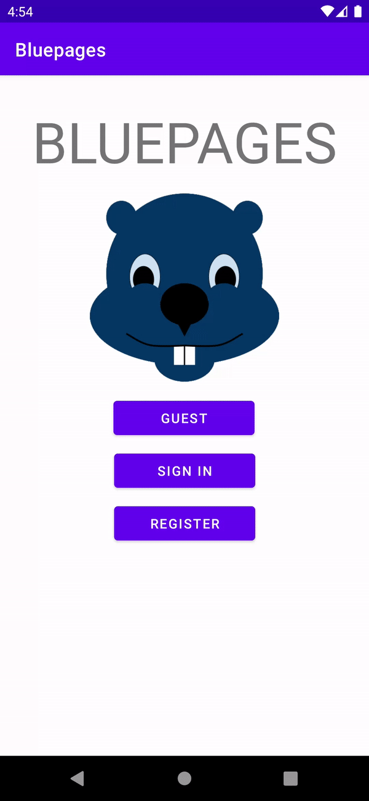

# Design Document #

## Specification ##

Bluepages is a location-browser app tailored to UofT students looking for places nearby the St. George Campus to grab food from, or study at. Users can share their opinions on places in the form of a review, and can also view what others think as well, thus helping them decide whether it's a place they'd like to visit.

- To browse the app, users can either create an account, login, or continue as a guest (no account).

| Light Mode                   | Dark Mode                   |
|------------------------------|-----------------------------|
|  |  |

### Permissions based off login-type

| User-type               | Permissions                                                                                                                                                      |
|-------------------------|------------------------------------------------------------------------------------------------------------------------------------------------------------------|
| Guest users can...      | <ul><li>Search for locations.</li><li>Use the interactive map to browse locations in their vicinity.</li></ul>                                                   |
| Registered users can... | <ul><li>Do everything a guest user can do.</li><li>Bookmark locations for easy access in the future.</li><li>Leave reviews and a rating for locations.</li></ul> |

### Locations ###

Across both types of locations, general information such as name and address are provided. However, future iterations of Bluepages looks to implement more specific info based off the location-type. See the major decisions section for
details of the final implementation.

| Location-type | Future Iterations                                                                                          |
|---------------|------------------------------------------------------------------------------------------------------------|
| Food          | <ul><li>Food type (i.e. Japanese).</li><li>Whether it's dine-in or takeout.</li><li>Price range.</li></ul> | 
| Study         | <ul><li>Whether it's indoors or outdoors.</li><li>Study room availability (if indoors).</li></ul>          |

## Changes From Phase1 ##

### Updated from Phase1 ###

From phase 1 to phase 2, we focused on refining the Android GUI. Despite the login and registration *seeming* unchanged, the backend now allows for account storage in a database which confers **data persistence**. Another change from phase 1 involves browsing the map in that pinpoints can now be placed at POIs, and further information on the point can be obtained by tapping it. Demonstrated below are these three key features in action:

| Login                      | Registration                      | Map Browsing                      |
|----------------------------|-----------------------------------|-----------------------------------|
|  |  |  |

### New Additions ###

Between phase 1 and phase 2, we also added new functionality to both the front and backend. The account menu allows the user (if logged-on) to browse their reviews and bookmarks in an organized manner. The location list provides a quick means to bookmark, and browse/leave reviews (once again, if logged-on) without needing to use the map. Furthermore, these bookmarks and reviews will **persist** across runs of the application.

| Account Menu                      | Location List                      |
|-----------------------------------|------------------------------------|
|  |  |

## Major decisions made by our group: ##
- Removing the plan for a food/study spot of the day. There were difficulties in how to get these spots, especially since location data is grabbed dynamically rather than all stored at once.
- Settling for basic location information (i.e. name, address, coordinates) rather than in-depth pieces because MapBox's API did not provide said in-depth pieces of information. The project would have extended past the deadline if a search for another API provider (whether to replace MapBox or to work alongside it) was done.

## Scenario walk-through 
Upon opening Bluepages, the user is greeted with an access menu from which three options are available; guest, login, and register. If the user is new to the app and wants extra functionality, they would select **REGISTER**.

They are now presented with a registration menu where they can enter their information. After validating the entered information (i.e. username and password), they are returned to the main menu where they can select the login option.

From here, the user selects **LOGIN**, and enters the info which they used to sign up for Bluepages. Upon successful login, the user is brought to the main menu where they can view an organized list of locations, access their profile, and view the map.

If **MAP** is selected, the user is presented with a map bound to Toronto, with a visible boundary around the vicinity of the St. George Campus. Within these bounds the map is freely pannable and zoomable, with food locations and study locations being easily tappable for more information. Should manual browsing not be the user's go-to, they can use the search bar to look-up nearby locations, presented as a pop-up menu with the location name and address displayed.

If **LIST OF LOCATIONS** is selected, a list of locations is presented to the user. These locations can be bookmarked, have their reviews accessed, or even have reviews left for them by the user. Both the user's bookmarks and reviews they've left appear under their account menu.

The **account menu** is accessed by the profile picture at the top left, and from it the bookmarks and reviews of a *logged-in user* can be viewed.

## Clean Architecture
**_How does our project adhere to Clean Architecture?_**
- The code follows the dependency rule (see dependency inversion under SOLID principles for more info)
- Interfaces are used as boundaries between layers to allow for dependency injection
- Data transfer objects and models are passed between layers rather than entities, as required by Clean Architecture

## Solid Principles
_**How is our project consistent with the SOLID design principles?**_

| SOLID Principle       | Explanations and Examples                                                                                                                                                                                                                                                                                                                                                                                                                                                                                                                                                                           |
|-----------------------|-----------------------------------------------------------------------------------------------------------------------------------------------------------------------------------------------------------------------------------------------------------------------------------------------------------------------------------------------------------------------------------------------------------------------------------------------------------------------------------------------------------------------------------------------------------------------------------------------------|
| Single responsibility | Examining `BookmarkManager` and `LocationMap`, the two are separate classes to hold in line with the SRP. Originally we had combined the responsibility of bookmarking locations and managing the map of locations in one class. In that case, should an actor want to change the process in how a bookmark is added, then it would have also affected the storage of locations in the map. With these two classes, if said actor were to change the process of bookmarking, the only changes made would be in `BookmarkManager`, because we still have `LocationMap` storing `Location`s separate. |
| Open / Closed         | By using interfaces between layers, we make our program much more open to extension while being closed for modification. This can be seen by our testing, where we were able to switch out dependencies for mockups to test in isolation with great ease due to the use of interfaces, showing how easy it is to extend functionality. More examples are discussed in the design patterns section.                                                                                                                                                                                                  |
| Interface segregation | We initially had larger `ReviewInputBoundary`, but this resulting in classes relying on interfaces with methods they don't use. As such, we refactored into the role interfaces of `ReviewAccountInputBoundary` and `ReviewLocationInputBoundary`.                                                                                                                                                                                                                                                                                                                                                  |
| Dependency inversion  | Dependency inversion was used throughout in order to maintain the dependency rule of Clean Architecture while keeping the correct flow of control. Between the layers of Clean Architecture, we made sure to use interface as boundaries, and thus both classes involved would depend on abstractions, following the DIP. For example, `AccountManager` uses the `AccountOutputBoundary` interface, which is implemented by `AccountPresenter`. The concretion is injected into `AccountManager`'s constructor, thus inverting dependency.                                                          |

## Packaging ##

_**Which packaging strategies did we consider? Which did we end up using, and why?**_

During our refactoring process, we first considered packaging by feature. However,
this proved to be difficult since there were a lot of files that shared similar attributes.
We ended up packaging by the layers of clean architecture (entities, use cases, adapters) because it was more efficient
(used the CRC cards and report from phase 0 for reference), and it can keep us all in check of fulfilling the clean
architecture model. As we created more classes, some packages got subpackages based on the domain the classes were related to
(accounts, locations, reviews).

## Design Patterns ##

_**Dependency Injection Design Pattern:**_

To better demonstrate Clean Architecture, we added the Dependency Injection Design Pattern throughout the code, as seen in the 
various injector classes at each layer. When the app starts, `AppInjector` is called to inject app dependencies into the 
framework layer, then it calls `AdapterInjector` which injects dependencies for the interface adapter layer of Clean Architecture.
Then, an injector is called to inject dependencies for each domain of the use cases layer (accounts, locations, reviews).

_**Observer Design Pattern:**_

We used an observer design pattern so that whenever the user logs in, the observable `AccountManager` notifies both the 
`ReviewManager` and `BookmarkManager` observers about the new user and retrieves the user's reviews and bookmarks. Previously,
the `AccountManager` would directly call the managers, which led to increase coupling between use cases. This way, it is much
more decoupled and open to extension, as if a new manager for another aspect were to be made, it would simply need to be injected
as another observer.

_**Adapter Design Pattern**_

The adapter design pattern was used in `AccountDAOAdapter`, `LocationDAOAdapter`, and `ReviewDAOAdapter` to adapt between 
the Room database's automatically implemented data access objects / data entities, which were specific to the Room database's
implementation, and our data access code. This would allow for us to easily switch out to another type of database by simply creating
new adapters for the new database, and also allows for easier testing as we can have a simple in-memory implementation for testing
purposes. We ended up doing so, which is explained more in the testing section.

_**Repository Design Pattern**_

The repository pattern was used to provide a collection-like interface for `Review`s to be added, removed, and retrieved. This
allowed for the use case interactors to be ignorant of the persistence mechanisms and encapsulated the data access logic. Since
the repository pattern is supposed to interact with domain level objects (i.e. entities in the Clean Architecture case), this
meant the use case interactors did not have to deal with data transfer objects, instead using `Review` entities only.

_**Simple Factory Design Pattern:**_

A simple factory design pattern is used in `LocationDataMapper`, which creates differing subclasses of `Location` based on the
type of location according to the database record.

## Use of Github Features ## 

During our implementation of Phase 1, our team made better use of branching in Github. Instead of each team member
working off of their own branch like we did during Phase 0, our team instead branched by feature. For example, we had a
branch dedicated to Serialization and upon second thought, the Serialization branch could have had two other branches
for each entity that was serialized. We also used the issues feature in Github which made it easy to highlight what
needed our attention.

## Testing ##

During Phase 2, we have worked to improve our test coverage from just testing two classes in the use case layer to now testing most classes in all layers of Clean Architecture. Due to the intense amount of refactoring and repeated changes to the main part of our program, currently we have 
finished testing for adapters, entities and use cases. Testing was made easier as the use of interfaces and dependency injection allowed
for classes to be tested isolated from its dependencies, relying on simple mockups on the dependencies instead. We decided not
to test the GUI and database packages as they are dependent on an instance of Android running which made it hard to test, rather we used
the humble object pattern and tested the data (access) package and presenters package instead.

## Progress Report ##

1. Open questions we are struggling with:
- Where information on the hours of service/price range of some locations can be obtained.
    - What APIs might be useful to fetch this data (MapBox does not provide this information).

2. What worked well so far:
- Keeping team members updated on progress through active team group chat
- Scheduling consistent meetings to brainstorm ideas and work through any issues
- Collaborating in writing code worked well when we were unfamiliar with implementing a certain feature
- Having different members with higher levels of proficiency in some areas so each member could help another when issues arise (i.e. Git, Android Studio, etc.)

3. What each group member has been working on and plans to work on next:

    Across all six of us, we have been ironing out Clean Architecture, but the next goal as a team is to further this use of Clean Archiecture to the UI and Android-specific elements (i.e. Activities).

|           | Work since Phase 1                                                                                                                                                                                                                                                                 | Link to a Significant Pull Request                                                                                                                                                                                                                   | Reasoning behind Pull Request                                                                                                                                                                                                                  |
|-----------|------------------------------------------------------------------------------------------------------------------------------------------------------------------------------------------------------------------------------------------------------------------------------------|------------------------------------------------------------------------------------------------------------------------------------------------------------------------------------------------------------------------------------------------------|------------------------------------------------------------------------------------------------------------------------------------------------------------------------------------------------------------------------------------------------|
| Ashenafee | Worked on implementing the 'pinpoint' feature for the map (i.e. being able to display 📍 at locations of interest) as well as displaying the name and address of said POIs.                                                                                                        | https://github.com/CSC207-UofT/course-project-aarves/pull/89 https://github.com/CSC207-UofT/course-project-aarves/pull/95                                                                                                                                                                                         | Allowing the visual representation of POIs to the user is a fundamental part of **any** map-oriented app. By implementing this, the app fully transitions from the CLI responses to a visual, 'nice-looking' response (in the form of points). Said POIs can be interacted with through a pop-up menu. |
| Anthony   | Implemented database and connected database into use case interactors and user interface. Refactored and changed packaging of files (including refactoring Android project to be at root), which is the reason for large amount of line changes.                                   | https://github.com/CSC207-UofT/course-project-aarves/pull/58 https://github.com/CSC207-UofT/course-project-aarves/pull/67 https://github.com/CSC207-UofT/course-project-aarves/pull/81                                                               | Needed a method of data persistence which complies with Clean Architecture, and needed to connect it to the other systems.                                                                                                                     |
| Erica     | Worked on creating AccountMenu for the GUI and testing for everything including presenters, interactors and usecases.                                                                                                                                                              | https://github.com/CSC207-UofT/course-project-aarves/pull/94 https://github.com/CSC207-UofT/course-project-aarves/pull/101                                                                                                                                                                                        | As shown in this pull request, the majority of classes are now tested, covering all layers of clean architecture which was one of our main feedbacks from Phase 1 where only 2 classes in the usecase layer were tested.                       |
| Rebecca   | Created GUI for locations, reviews, create reviews, bookmarks, main menu, and adapters to display information. Cleaned up GUI interface and features.                                                                                                                              | https://github.com/CSC207-UofT/course-project-aarves/pull/86  https://github.com/CSC207-UofT/course-project-aarves/pull/87 https://github.com/CSC207-UofT/course-project-aarves/pull/88 https://github.com/CSC207-UofT/course-project-aarves/pull/91 | The bulk of the front end and display logic are in these pull requests.                                                                                                                                                                        |
| Syed      | Tested everything by creating new test-cases, while simultaneously fixing test-cases for refactored files from phase 1 and phase 2. Helped Erica fix her failing test cases. Also, worked on figuring out how to add markers/pointers to the map and tried setting map boundaries. | https://github.com/CSC207-UofT/course-project-aarves/pull/93 https://github.com/CSC207-UofT/course-project-aarves/pull/101                                                                                                                           | Contains all the test cases for Use-Case files and refactored files, contains commits for fixing buggy test cases                                                                                                                              |
| Vaishnavi | Helped assist with the GUI by working on some of the xml files need for location previews and cleaning up previously made xml files. Helped create a potential filter for each type of location (food location and study location). Helped merge branches and made pull requests.  | https://github.com/CSC207-UofT/course-project-aarves/pull/84 https://github.com/CSC207-UofT/course-project-aarves/pull/92                                                                                                                            | The first pull request was for the previews of the locations, so the general xml files that is shown in our app. The second pull request was for the search filters regarding locations.                                                       |
